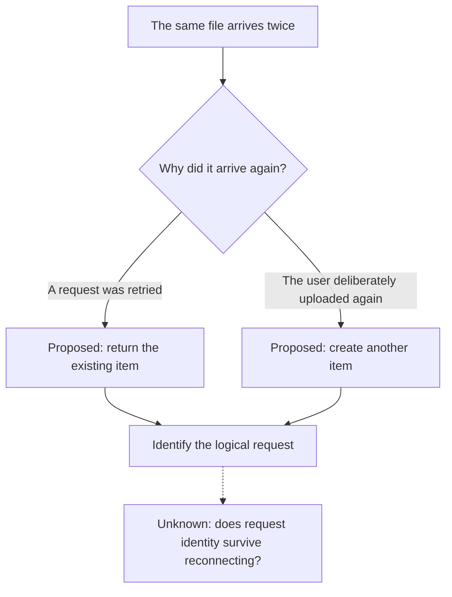

# Using a picture to find the question

Suppose a user reports duplicate uploads. The first instinct might be to reject files with identical content. A small diagram exposes the product decision hidden in that idea.

This example is fictional. The branches describe proposed behaviour, not findings from an executed system.

The decision is whether a deliberate second upload should create another item. If so, file content alone cannot distinguish it from a retry. The unknown at the bottom becomes a question for an experiment.

In a real session, the picture would change as evidence arrives. A reproduced behaviour could be marked as observed, while an untested fix would remain proposed. The picture helps choose the next action; it cannot demonstrate that the fix works.

## Choose the format for the question

| What needs explaining | A useful form |
| --- | --- |
| Where a request goes or repeats | Flow or sequence diagram |
| Which transitions are possible | State diagram |
| Where a responsibility lives before and after a proposed refactor | Two small architecture diagrams |
| What changes when an input changes | Interactive view, if the host supports it |
| Which option meets a few concrete constraints | Comparison table |

For static relationships, Mermaid can keep the explanation in the conversation or repository. Use the host's native visual surface where available. A text sketch is sufficient when it conveys the relationship clearly. Save a standalone report when someone needs to share it outside the session.
